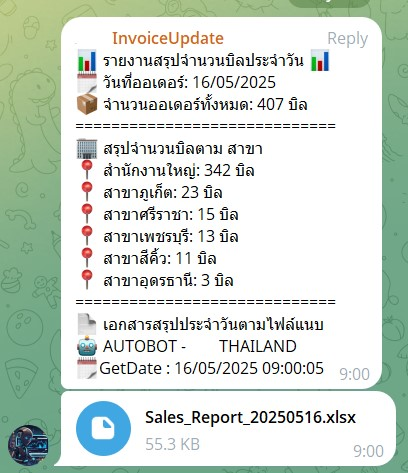

# 📦 Telegram_Bot_Invoice

**Telegram_Bot_Invoice** is designed to deliver shipping details for each branch via Telegram.  
Each branch is assigned to its own dedicated group chat, where the bot sends **daily summary reports** of all shipments.

⏰ The bot automatically sends these reports **three times a day**:
- 9:00 AM
- 2:00 PM
- 5:00 PM

---

### ✅ Purpose

This bot was created to **reduce the workload of the warehouse team**, who previously had to manually compile and summarize shipping data in Excel every day.

---

### ⚙️ How It Works

1. **Telegram Group Setup**  
   A dedicated group chat is created in Telegram for each branch. The bot uses a unique **`BOT TOKEN`** and **`CHAT_ID`** for each group to send messages.

2. **Data Processing**  
   Shipping data is fetched from the database, then processed using a custom Python script to generate summary reports in the desired format.

3. **Automation**  
   A **batch script** is written to execute the Python script.  
   This batch file is scheduled using **Windows Task Scheduler** to run automatically at the following times:
   - 9:00 AM
   - 2:00 PM
   - 5:00 PM

This system ensures consistent, timely reporting without the need for manual intervention.

---

### 🚀 Features
- Automatic daily report delivery
- Group separation by branch
- Easy integration with existing Telegram groups
- Reduces manual reporting tasks

---

### 🛠️ Tech Stack
- Python
- Telegram Bot API
- Windows Task Scheduler
- Batch scripting
- SQL Server